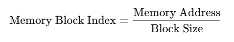

# cache-miss-analyzer &mdash; a high-performance cache simulator with LRU policy

 

 

This project implements a **Set-Associative Cache** simulator using an **LRU (Least Recently Used)** replacement policy. It reads a trace file containing memory addresses in hexadecimal and simulates how the cache behaves, eventually reporting the **miss rate**.

 

## Features

- **Set-Associative Cache**: The user specifies the total cache size (in KByte), the block size (in Words), and the set degree (N-Way).    
- **Unit Tests**: Contains a test module that can read a `trace.txt` file and print the contents of each set to debug and verify correctness.

 

## Overview

1. **Computing Steps and Formulae**

- Initially, convert hexadecimal memory addresses to decimal, making it easier to perform division and modulo operations.
  

- Compute the total number of cache blocks:
  

  

- Compute the number of sets (each set holds set_degree (N-Way) blocks):
  

  

- Each block contains multiple bytes, so we determine which memory block the address belongs to:
  

  

- Determine where in the cache this block should be mapped:
  

  

- Compute the tag:
  

  

- After processing all memory accesses in trace file, compute:
  

  

2. **HashMap + Doubly Linked List**  
   - **HashMap**  
     - Maps a **tag** inside that set to a node in the doubly linked list. 
 
     - This allows O(1) lookup to find whether a memory block is currently in the cache.  
   
   - **Doubly Linked List**  
     - Each set keeps a doubly linked list of its N blocks.  
     
     - The head represents the most recently used; the tail represents the least recently used.  
     
     - On a **hit**, the block is moved to the head; on a **miss**, if the set is full, the tail block is evicted (LRU), otherwise an empty slot or invalid block is used.

     - Why using a doubly linked list? Because when tracking usage order in the lists, removing a node from the middle or moving a node to the front are needed frequently. A doubly linked list allows you to perform the operations mentioned above in O(1). By contrast, a singly linked list requires O(n) time to find the predecessor before removal.
    
    **Dummy Head and Tail**  
    - To simplify insertions and deletions, each set maintains two dummy nodes, namely the **dummy head** and the **dummy tail**. The dummy head ensures that there is always a first node (most recently used item), whereas the dummy tail ensures that there is always a last node (least recently used item). 
      
    - Without dummy nodes, inserting or removing from the beginning or end of the list would require additional boundary checks.
  
3. **Valid Bit Mechanism**  
   - Originally, this project did not pre-allocate any invalid blocks. Instead, it simply builds a new Node on every miss if `size < capacity`. If `size == capacity` (the set is full), it evicts the least recently used node (via `evict()` method) before inserting the new one.

    - In other words, the design omits a `valid = false` state, relying on the condition `size < capacity` to detect free capacity. Each Miss either:
        - Creates a new node if not at capacity, or  
        - Evicts the oldest node if at capacity.

    - According to project requirement, checking the validation of each cache block is needed when accessing. As a result, I came up with another solution `valid_checking_lru` by adding some helper methods. If a block is `valid=false`, we can fill it without evicting another block; if all blocks are `valid=true`, we perform an LRU eviction.   

---

## Getting Started   

The Prerequisites, Building & Running and Test section are placed in both <a href="dynamic_way_lru/README.md">dynamic_way_lru/README.md</a> and <a href="valid_checking_lru/README.md">valid_checking_lru/README.md</a>, check out the details of each.

---

## Test Data & Verification   
This project includes a large set of test data and sources, generated using Generative AI. To ensure correctness, I compared the AI-generated results with results computed by my project (both dynamic_way_lru and valid_checking_lru). All test cases have passed verification.
 

---

### Test Data & Answer
- `trace.txt`: Contains 5003 lines of test addresses.

  - Cache Configuration: User-defined.

  - Contains a general set of memory addresses for  testing the LRU mechanism.

  - Users can specify different cache sizes, block sizes, and set degree (associativity) values to observe varying results.

 

- `test_50.txt`: Contains 50 lines of test addresses.

  - Cache Configuration:

    - Cache Size: 1 KBytes

    - Block Size: 16 words

    - Set Degree (Associativity): 2-way

 

- `test_100.txt`: Contains 100 lines of test addresses.

  - Cache Configuration:

      - Cache Size: 1 KBytes

      - Block Size: 4 words

      - Set Degree (Associativity): 2-way

 

- <a href="data/answer.md">answer.md</a>: Shows the expected results for all test files and the tags in each cache set, useful for verifying correctness. The most frequently accessed tags appear first in each set.

 

---

### Use Cases & Applications

- Computer Architecture Studies: Helps understand cache memory behavior and performance implications of different cache configurations.
  
- Performance Benchmarking: Useful for analyzing memory access patterns and optimizing software performance.
  

---

### Contributing

Contributions are welcome!  

1. Fork the repo and create a branch.  
2. Make changes and ensure everything works.  
3. Follow the coding style.  
4. Open a pull request with details.  

For major changes, please open an issue first.

 

---

### License

This project is licensed under <a href="LICENSE">MIT license</a>.
