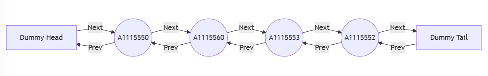

# Dynamic-Way LRU &mdash; a dynamic allocation approach

<br>

The Dynamic-Way LRU (Least Recently Used) cache is a memory caching mechanism that dynamically allocates and evicts cache blocks based on access patterns. Unlike traditional set-associative caches that pre-allocate all blocks with **valid** field all set to false, this approach only creates cache blocks when needed, ensuring efficient memory usage while maintaining LRU-based eviction.

<br>

## Features
- **Dynamic Allocation**: Cache blocks are created on demand instead of being preallocated.

- **LRU Eviction**: The cache maintains a doubly linked list to efficiently track (update) and evict the least recently used blocks.

<br>

## Implementation Details
- Each Set contains a **HashMap** (tag -> Node) and a **doubly linked list** for LRU tracking.

<br>

- Upon accessing a block:

    1. If the block already exists in the cache (Hit), it is moved to the front of the doubly linked list.

    2. If it does not exist (Miss) and the set still have space, a new block is dynamically allocated.

    3. If the set is full, the LRU block (tail of the list) is evicted before adding a new one. Afterwards, the new block is also moved to the front of the list.

<br>

- No valid = false tracking mechanism is used since blocks are dynamically allocated and evicted.

<br>

## Step-by-Step Explanation

### Initial State
``Empty Cache Set``: Before any memory accesses, the set only has dummy head and dummy tail. <br>


<br>

### First Access: A1115550
`Miss!` A1115550 is not in the set.

Insert it at the front of the list.


<br>

### Second Access: A1115551
`Miss!` A1115551 is also missing.

Insert it at the front, shifting A1115550 back.


<br>

### Third Access: A1115550
`Hit!` A1115550 is in the set.

Move it to the front.


<br>

### Filling Up the Set (Set is Full)
More blocks (A1115552, A1115553) are accessed and added until the set is full (4-way associativity).


The set is now full, next miss will trigger LRU eviction.

<br>

### Access A1115560 (Eviction required)
`Miss!` Because A1115560 is not in the set.

The set is full => Evict LRU block (A1115551).

Insert A1115560 at the front.


<br>

### Another Hit – A1115550
`Hit!` A1115550 is in the set.

Move it to the front (MRU).



<br>

## Time Complexity Analysis

### Lookup (Hit/Miss Checking)

- Using HashMap<tag, Node>, checking if a block is present takes `O(1)`.

<br>

### Insert New Block (On Miss)

- Insert at the head of the doubly linked list (O(1)).

- Insert into HashMap (O(1)).

Overall: O(1) + O(1) = `O(1)`.

<br>

### Move Block to Head (On Hit)

- Find in HashMap: O(1).

- Remove from current position: O(1).

- Insert at the front: O(1).

Overall: O(1) + O(1) + O(1) = `O(1)`.

<br>

### Eviction (When the set is full)

- Identify LRU block (always at the tail): O(1).

- Remove from doubly linked list: O(1).

- Remove from HashMap: O(1).

- Insert new block at head: O(1).

Overall: O(1) + O(1) + O(1) + O(1) = `O(1)`.

<br>

### Summary

|   Operation   |  Complexity  |
|---------------|--------------|
|Lookup	        |     O(1)     |
|Insert 	    |     O(1)     |
|Move to Head 	|     O(1)     |
|Eviction       |	  O(1)     |

<br>

**Overall Complexity: `O(1)`.**

<br>

---

## Getting Started <br><br>

### Prerequisites

- [Rust](https://www.rust-lang.org/) (recommended 1.84.1 or higher)
- A terminal or command prompt to run `cargo`
<br><br>
---

### Building and Running

Clone the repository

```bash
git clone https://github.com/mellivorandy/cache-miss-analyzer.git
```

<br>

From the project root, run:

```Rust
cargo build
```

<br>

To execute the program with custom arguments, use the following command:

```Rust
cargo run -p dynamic_way_lru -- <trace_file_name> <cache_size> <block_size> <set_degree>
```

- <trace_file_name>: The path of the trace file to be analyzed.
- <cache_size>: The total size of the cache (in KByte).
- <block_size>: The size of each block (in Words).
- <set_degree>: The associativity (number of blocks per set).

<br>

In this project structure, the trace.txt file is located in cache-miss-analyzer/data, change the path if the trace file is moved or new trace files are added.

<br>

Note: If the file path remains unchanged, use the path as given. Simply copy and paste the following command into your terminal:

#### Example command

```Rust
cargo run -p dynamic_way_lru -- ./data/trace.txt 128 4 1
```

<br>

---

### Test

A `[cfg(test)]` test module is included, referencing a trace.txt file for unit tests. To run them:

```Rust
cargo test -p dynamic_way_lru -- --nocapture
```

This prints the non-empty sets.

- Change arguments at dynamic_way_lru/src/main.rs:69:39 for different cache configurations.

<br>

- Remove if expressions at dynamic_way_lru/src/main.rs:92:13 as you want to print all sets.

<br>

## Acknowledgments
  
I sincerely appreciate the incredible work behind [Mermaid.js](https://mermaid.js.org/), an open-source diagramming tool that makes visualizing complex ideas effortless. Huge thanks to the developers and contributors who maintain and improve this fantastic project!
