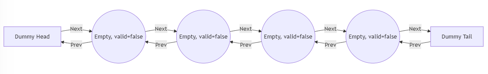
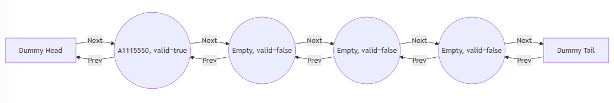
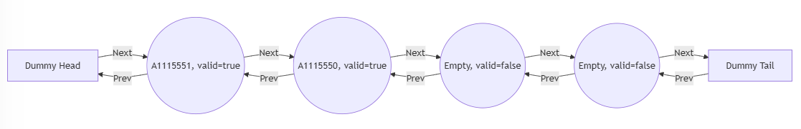
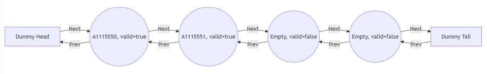
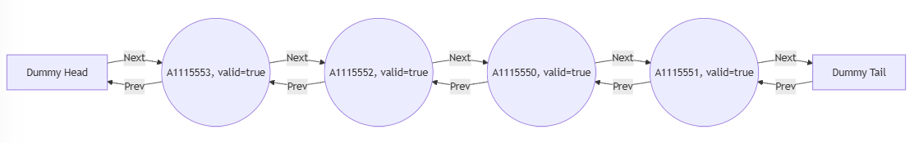
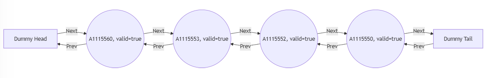
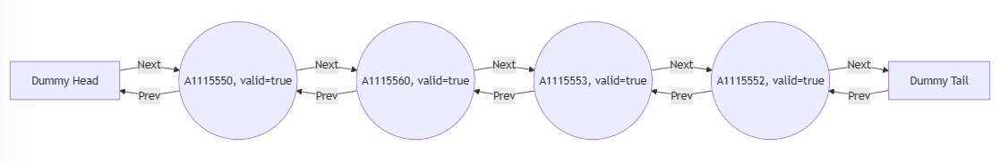

# Valid-Checking LRU &mdash; a preallocated block management approach

<br>

The Valid-Checking LRU (Least Recently Used) cache is a set-associative cache implementation that pre-allocates all cache blocks at initialization. Unlike dynamically allocated caches, this approach marks blocks as valid=false when they are not in use.

<br>

## Features
- **Pre-allocated Blocks**: All cache blocks are created at startup and stored in a fixed-size structure.

<br>

- **Valid Bit Tracking**: Each block has a valid flag to indicate whether it contains a tag.

<br>

## Implementation Details
- Each Set contains a **HashMap** (tag -> Node) and a **doubly linked list** for LRU tracking.

<br>

- Pre-allocated fixed-size cache blocks (**valid = false** initially).

<br>

- Upon accessing a block:

    1. If the block exists in the cache (Hit), it is moved to the front of the list.

    2. If it does not exist (Miss), an invalid block is reused if available.

    3. If all blocks are valid=true, the least recently used (LRU) block is evicted. Then, the new block is created and moved to the front of the list.

<br>

## Step-by-Step Explanation

### Initial State
Empty but Preallocated Blocks.

Unlike Dynamic-Way LRU, all blocks are initialized with valid=false at the start.



<br>

### First Access: A1115550
Miss! But there are still invalid blocks available.

Instead of evicting, use an invalid block.

Mark it valid=true and move it to the front.



<br>

### Second Access: A1115551
Miss! But still, there are invalid blocks available.

Use an invalid block, mark it valid, move it to the front.



<br>

### Third Access - A1115550
Hit! A1115550 is already in the set.

Move it to the front (most recently used).



<br>

### Filling Up the Set (Set is Full)
After accessing A1115552 and A1115553, the set is full.

Every block is now valid=true, so next miss must trigger an eviction.



<br>

### Access A1115560 (Eviction required)
Miss! No invalid blocks remain.

Evict LRU block (A1115551, closest to Dummy Tail).

Replace it with A1115560 and move to the front.



<br>

### Another Hit – A1115550
`Hit!` A1115550 is in the set.

Move it to the front (MRU).



<br>

## Time Complexity Analysis

### Lookup (Hit/Miss Checking)

- Using `HashMap<tag, Node>`, checking if a block is present takes $O(1)$.

<br>

### Insert New Block (On Miss)

Two scenarios for handling a miss:

1. Use an invalid block: $O(N)$, worst-case requires searching all set entries.

2. Evict LRU block (if all are valid): $O(1)$.

<br>

**Case 1**: Use an invalid block
Search for a valid=false block: $O(N)$ (N = set_degree, worst case is that all blocks are valid).
Update block's tag and set valid=true: $O(1)$.
Move block to head (most recently used): $O(1)$.

Overall: $O(N) + O(1) + O(1) =`O(N)$.
(Worst case: scanning all blocks in the set to find an invalid one)

<br>

**Case 2**: Evict LRU block (All blocks are valid=true)
Find LRU block (always at the tail): O(1).
Replace with new block, update tag, set valid=true: O(1).
Move to head (most recently used): O(1).

Overall: $O(1) + O(1) + O(1) = O(1)$.

<br>

### Move Block to Head (On Hit)

- Find in HashMap: $O(1)$.

- Remove from current position: $O(1)$.

- Insert at the front: $O(1)$.

Overall: $O(1) + O(1) + O(1) = O(1)$.

<br>

### Eviction (When the set is full)

- Identify LRU block (always at the tail): $O(1)$.

- Remove from doubly linked list: $O(1)$.

- Remove from HashMap: $O(1)$.

- Insert new block at head: $O(1)$.

Overall: $O(1) + O(1) + O(1) + O(1) = O(1)$.

<br>

### Summary

|   Operation   |  Complexity  |
|---------------|--------------|
|Lookup	        |    $O(1)$    |
|Insert 	    |    $O(N)$    |
|Move to Head 	|    $O(1)$    |
|Eviction       |	 $O(1)$    |

<br>

**Overall Complexity: `O(N)`.**

<br>

---

## Getting Started <br><br>

### Prerequisites

- [Rust](https://www.rust-lang.org/) (recommended 1.84.1 or higher)

- A terminal or command prompt to run `cargo`

<br>

---

### Building and Running

Clone the repository

```bash
git clone https://github.com/mellivorandy/cache-miss-analyzer.git
```

<br>

From the project root, run:

```Rust
cargo build
```

<br>

To execute the program with custom arguments, use the following command:

```Rust
cargo run -p valid_checking_lru -- <trace_file_name> <cache_size> <block_size> <set_degree>
```

- <trace_file_name>: The path of the trace file to be analyzed.
- <cache_size>: The total size of the cache (in KByte).
- <block_size>: The size of each block (in Words).
- <set_degree>: The associativity (number of blocks per set).

<br>

In this project structure, the trace.txt file is located in cache-miss-analyzer/data, change the path if the trace file is moved or new trace files are added.

<br>

Note: If the file path remains unchanged, use the path as given. Simply copy and paste the following command into your terminal:

#### Example command

```Rust
cargo run -p valid_checking_lru -- ./data/trace.txt 128 4 1
```

<br>

---

### Test

A `[cfg(test)]` test module is included, referencing a trace.txt file for unit tests. To run them:

```Rust
cargo test -p valid_checking_lru -- --nocapture
```

This prints the non-empty sets.

- Change arguments at valid_checking_lru/src/main.rs:69:39 for different cache configurations.

<br>

- Remove if expressions at valid_checking_lru/src/main.rs:92:13 as you want to print all sets.

<br>

## Acknowledgments
  
I sincerely appreciate the incredible work behind [Mermaid.js](https://mermaid.js.org/), an open-source diagramming tool that makes visualizing complex ideas effortless. Huge thanks to the developers and contributors who maintain and improve this fantastic project!
